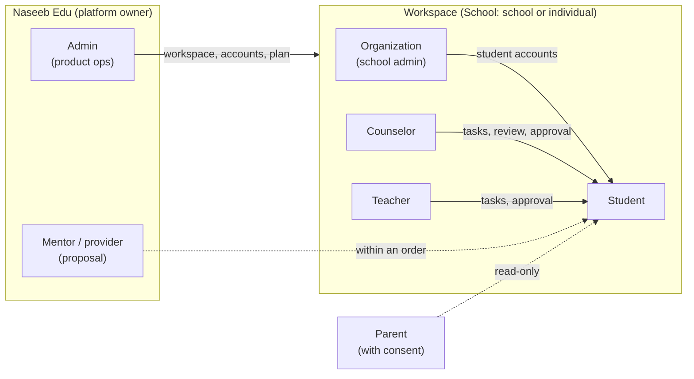
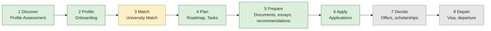
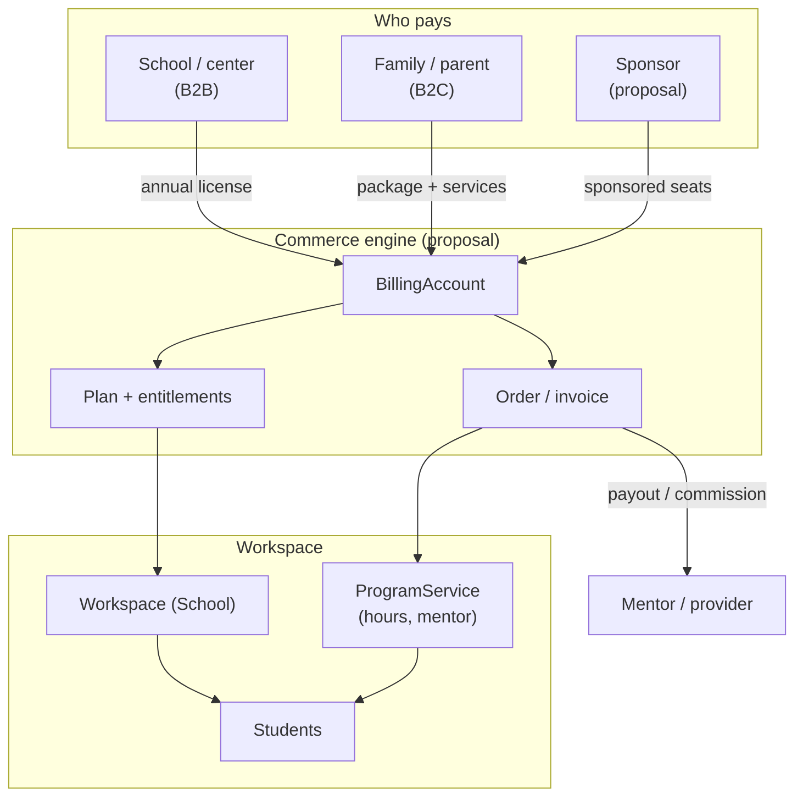
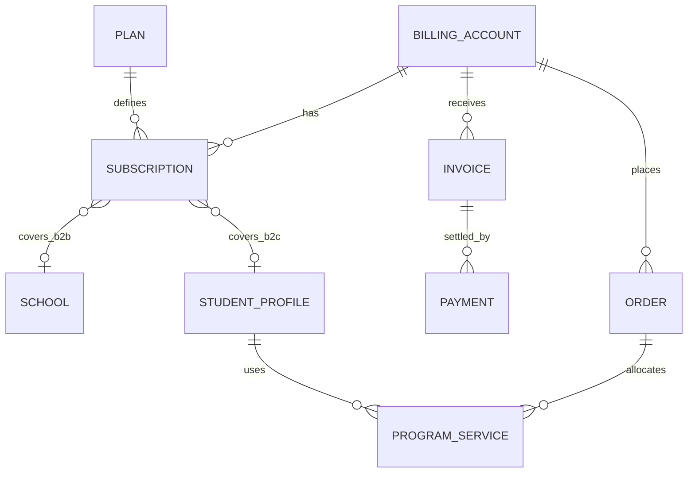
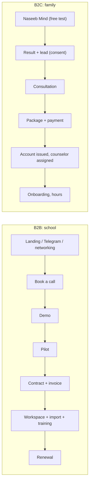
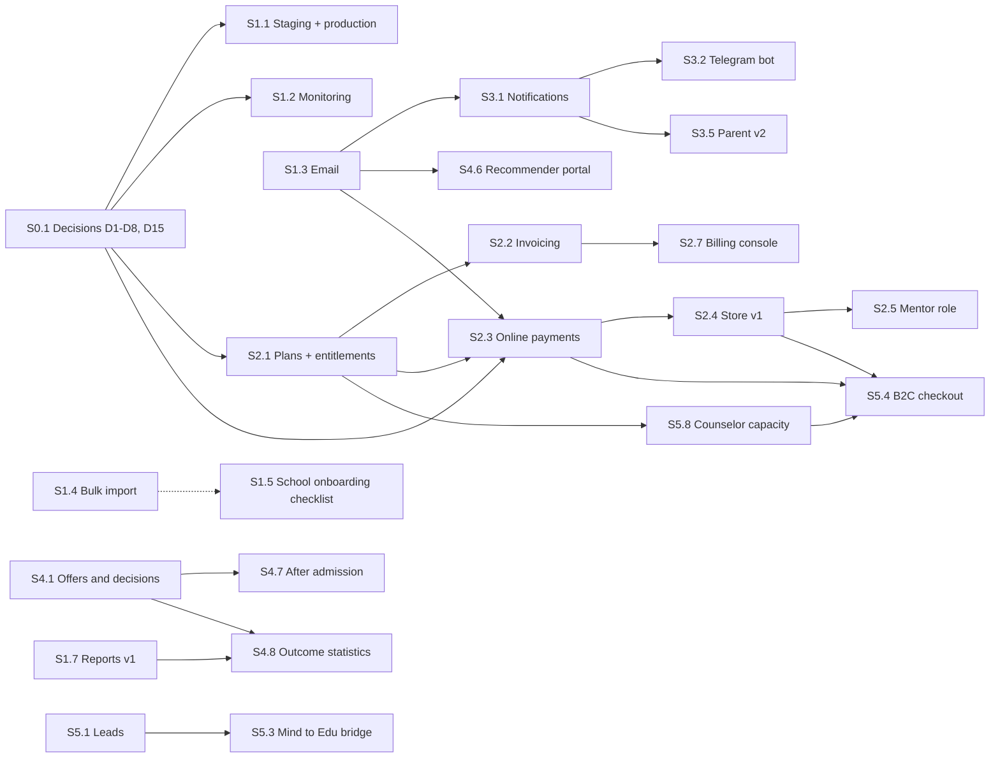

# Naseeb Edu — Product Vision, Business Model and Staged Plan

> **Status:** DRAFT v0.1 — for team discussion
>
> **Date:** 2026-09-24 · **Code state source:** `origin/main` @ `465cf9a`
>
> **Legend:** ✅ exists · 🟡 partial · ⬜ missing · ⏸ awaiting decision · 🔷 proposal (not yet approved by the team)

---

## 0. Why this document exists

Three steps agreed by the team:

1. Write down precisely how the product works in its **perfect state** and which features it has.
2. Define the logic of **B2B, B2C and the business model**.
3. Split everything into **stages** and discuss them. Pieces that do not depend on each other are built separately, and each lands in `main` as a small PR. That way we move fast and weekly progress is visible to everyone.

### Ground rules

- **Facts and proposals are not mixed.** A "fact" is something verified from the code and git. A "🔷 proposal" is the author's draft. Until the team decides, a proposal is not a plan.
- **Prices, percentages and business durations (pilot, grace, refund) are deliberately left blank.** These are team decisions (section 6); formulas and variables are provided for them (4.6). Technical targets (3.9) are 🔷 hypotheses.
- **This file is the single source of truth.** When a decision is made, the table in section 6 is updated via PR.
- **Discussion order (sections):** 1 → 3 (vision) → 4 (business model) → 6 (decisions) → 5 (stages). Stages are approved after the decisions.

### Who reads what

| Who | Main sections |
| --- | --- |
| Founder / CEO | 1, 4, 6, 7 |
| Product (CPO) | 3, 5, 6 |
| Engineering (CTO, developers) | 2, 3.9, 5, Appendices |
| Operations (COO), content | 3.7, 4.8, 5.4, 5.5 |

---

## 1. Summary

**What.** Naseeb Edu is an education counseling platform for schools, counselors, students and families in Uzbekistan. It runs the whole international-university application process in one system. Principle: *human counseling + software*. The software organizes the process and the evidence; the counselor makes the decision.

**Today (fact).** 6 roles, 3 languages (uz/ru/en), and a full CRM for the student journey: profile → assessment → match → roadmap → documents/essays → applications → meetings/messages. There is a parent portal, admin control, and an AI assistant (code ready; production activation is open, H8). **There is no revenue mechanism:** no payments, plans, subscriptions or invoices. The Store is sample cards only.

**The perfect state (3 sentences).**

1. A school connects with a single contract. Students are imported, counselors work from a daily queue, and the school head sees outcomes: how many students got in where, and how much scholarship money was won.
2. A family enters for free through Naseeb Mind, buys a package if needed, and is assigned a personal counselor.
3. Everything runs on reminders (Telegram / email). Data is kept private and in line with Uzbekistan's requirements.

**Business model (🔷 proposal).** A B2B school license (main, stable revenue) + B2C family packages and services (growth) + B2B2C (extra services for families inside a school) + optional sponsor cohorts. One platform, one `workspace` (tenant) model, and plan = a set of entitlements.

**The 5 biggest gaps (fact).**

1. **No revenue mechanism** — no payments, plans or invoices.
2. **Notifications are not delivered** — email and Telegram are not configured and the UI was removed; deadline reminders do not work.
3. **The university catalog is small** — 16 universities verified with source links (8 US + 8 Canada) and 32 programs, while onboarding offers 7 countries.
4. **Production foundations** — there is no staging, no monitoring and no legal pack (ToS/Privacy); the move to Sirdaryo is open.
5. **Outcomes are invisible to schools** — there are no reports and no offer/scholarship/enrollment tracking. This is exactly the main proof point for B2B sales.

**The next 2 weeks (🔷).** See section 5.4.

---

## 2. Current state (fact)

Source: `origin/main` @ `465cf9a`, the code, git history and `todo.todo` (the Uzbek-language backlog).

### 2.1 Numbers

| Metric | Value |
| --- | --- |
| Git | 78 commits on `main`, 2026-07-20 → 2026-09-23 (~9 weeks) |
| Backend | Django 5.2 + DRF + JWT; 45 models (41 `admissions` + 4 `users`); ~162 Django tests; CI: migration drift + tests + `npm run build` + smoke |
| Migrations | 39 files in `admissions` (numbers 0027 and 0028 each appear twice; merge migrations `0030` and `0033`), 6 files in `users` |
| Frontend | React 19 + Vite, `App.jsx` 3,915 lines, `LandingPage.jsx` 1,463 lines, 35 pages in `PAGE_META` |
| Languages | The interface is fully uz/ru/en; content (catalog, program descriptions) is in English |
| Content | 154 opportunity programs (146 international + 8 national), 16 universities / 32 programs (US + Canada), 96 careers / 55 majors / 16 families (career database), 4 assessments, 4 sample services in the Store |
| Hosting | Configured for Render (`README`, `Procfile`, `build.sh`). The current production setup is not visible in the code — the team must confirm it |
| Move to Sirdaryo servers | open (`todo.todo` H10) |

### 2.2 Module status

| Module | Status | Notes |
| --- | --- | --- |
| Accounts: issued logins, one-time password, forced password change, JWT (old sessions are revoked when the password changes), rate limits | ✅ | No public registration |
| Workspace (`School`): school / individual counselor; at most 3 counselors per school | ✅ | The limit of 3 is strict and not tied to a plan |
| Student onboarding: 6 steps, photo, guardian; the cabinet stays closed until it is finished | ✅ | |
| Profile Assessment: Big Five (50), RIASEC interests, subjects, ICAR-16 reasoning (16); versioned attempts | ✅ | `ChallengeAttempt` rows are never overwritten |
| Career/major matching + AI explanation | 🟡 | Code is ready; activating it in production with a provider key and legal sign-off is open (H8); without a key a deterministic fallback runs |
| University Match (profile-based, filters, shortlist) | 🟡 | The catalog is small (16 universities) |
| Programs (154) and the Scholarship catalog | ✅ | No tracking of scholarship applications |
| Roadmap: Level 1 (8 missions), prerequisites, staff approval, stars/XP, level-up approval | ✅ | No Level 2+ |
| Tasks (staff tasks + self-tasks; self-tasks award no XP) | ✅ | |
| Applications (tier, status history) | ✅ | No offer/decision stage |
| Documents (private storage, 25 MB, review states) | ✅ | |
| Essay Lab (versions, comments, Google Docs) | ✅ | No inline comments |
| Recommendation letters (tracking, file) | ✅ | No link for the recommender; no email is sent |
| Portfolio (achievements, research, projects, internships, activities, honors) | ✅ | |
| Meetings (`Booking`: request → approval) | 🟡 | No availability slots, calendar or reminders |
| Messages: direct / group / community / discussion + reports and moderation | ✅ | |
| Support tickets, Screen Time, PDF export | ✅ | |
| AI assistant (read-only, PII redaction, audit) | 🟡 | Production activation is open per `todo.todo` (H8); the team must confirm the current state |
| Parent portal (invite → consent → the child's 5 sections, per-section permissions) | ✅ | No messaging or digest |
| Student 360 (privacy-safe view for school/admin) + audit | ✅ | |
| Admin control: schools, counselors, roadmap templates, audit, support, moderation | ✅ | |
| Landing (uz/ru/en, reach map, FAQ, "Book a call") | ✅ | Leads are not stored (it sends people to Calendly) |
| Store and `ProgramService` (hour allocation) | 🟡 | The Store has sample prices; there is no purchase flow |
| Notifications | ⏸ | The model exists, the UI was removed, there is no delivery (M10) |
| Bulk import (students) | 🟡 | Only on a separate branch, not on `main` |
| Payments, plans, subscriptions, invoices | ⬜ | |
| Email sending, Telegram, calendar/ICS, MFA, PWA | ⬜ | Not found in the code |
| Monitoring, staging environment, E2E tests | ⬜ | No trace in the repo (only CI + smoke script + 4 node tests); the team must confirm any hosting-level setup |

### 2.3 Work in flight (not merged into `main`)

- **Student import** (file mapping, preview, commit) — `feature/student-bulk-import`, since 2026-09-07. It has fallen behind `main` and needs a rebase.
- **Naseeb Mind signup preview** (`#/signup-preview`, "while preserving the existing school-issued account flow") — `naseeb-mind-signup-preview`, 2026-09-20.

### 2.4 Technical debt and obstacles to parallel work

1. **Large "hot" files:** `App.jsx` (3,915), `views.py` (3,286), `serializers.py` (1,977), `styles.css` (2,033), `tests.py` (2,943). If two or three people touch them at once, conflicts are inevitable. Fix: section 5.1, rule 6.
2. **History of migration collisions:** the numbers 0027 and 0028 each appeared twice, and merge migrations `0030` and `0033` were needed. Fix: section 5.1, rule 7.
3. **Internal documents lag behind the code** (Stage 0): the internal instruction file at the repo root says "there is no Math/IQ module", but `reasoning` (ICAR-16) exists; it calls the AI module `ai_services.py`, but the real name is `education_ai.py`; it says RIASEC has "12 questions", but the real assessment is a 50-item Big Five plus O*NET RIASEC. The `README` says "English-only interface", its roles table lacks Parent and Admin, and it lists a "notification center" (the UI was removed). The landing FAQ says "parents review it from the student's account", yet a separate Parent portal exists.
4. **Catalog updates require a deploy** (a new migration + a JSON snapshot). The content team cannot work independently.
5. **There is no frontend test runner** (only a smoke script, the i18n audit and 4 node tests), and no E2E.
6. **Knowledge concentration (bus factor):** most commits come from 1–2 accounts. PR review and documentation reduce this risk.

---

## 3. The product in its perfect state

### 3.1 Principles (🔷; most already exist in the code and on the landing page)

1. **Human counseling + software.** AI never makes decisions (the landing page promises this).
2. **Progress is earned, not claimed.** Staff approve tasks, missions and levels. The readiness percentage shows preparation, not the probability of admission.
3. **The data belongs to the student and the family.** The school and the counselor see it within the limits of the contract and consent. Who sees what is spelled out in a table (Appendix B). Changing this scope is a privacy decision, not a refactor.
4. **Accounts are "issued", not "registered".** The landing page promises this ("0 public sign-ups"). Keeping or dropping the principle for B2C is decision D1.
5. **Students are minors** (grades 8–11): parental consent, minimal data, no third-party trackers.
6. **Uzbekistan-first:** uz/ru/en, local payments, Telegram, local hosting requirements.
7. **Every feature has:** loading / empty / error states, uz/ru/en copy, and a "wrong role" negative test.
8. **Small steps:** every slice is its own PR and its own demo.

### 3.2 Roles and the tenant model

| Role | In the perfect state | Today |
| --- | --- | --- |
| **Admin** (Naseeb ops) | Workspaces, accounts, plans, content, support, audit, moderation, billing | 🟡 No billing or content CMS |
| **Counselor** | Works from a daily queue on assigned students: review, approval, meetings, parent communication | 🟡 No queue or bulk actions |
| **Teacher** | Assigns tasks and missions to students of their own school and approves them | ✅ |
| **Organization** (school admin) | School cohort, reports, counselor and student accounts, billing | 🟡 No reports or billing |
| **Student** | One clear next step; the whole journey in one place | ✅ |
| **Parent** | Sees the child's progress with consent, is notified, pays | 🟡 No digest, messaging or payments |
| **Mentor / provider** (🔷 new) | Delivers a purchased service; sees only the student data within their order | ⬜ |

**Tenant rules.**

- `School` = workspace (`school` or `individual`). A student, counselor, teacher and organization each belong to a single workspace. A parent sits outside the workspace and is linked through `ParentStudentLink`.
- A plan and subscription attach to a workspace (4.5). In B2C, a subscription attaches to a student (4.5).
- An individual workspace can currently serve two purposes: (a) a freelance counselor as a micro-customer, (b) Naseeb's own counselors serving families. They differ in billing (D6).

### 3.3 The student journey

| Journey step | In the perfect state | Today |
| --- | --- | --- |
| 1 Discover | 4 assessments, a result page, career and major recommendations, a yearly retake and comparison | ✅ / 🟡 comparison UI → S4.11 |
| 2 Profile | A 6-step profile, test scores, activities and honors | ✅ |
| 3 Match | A transparent match by profile and budget, a reason for each, a shortlist, a tier suggestion | 🟡 → S4.4, S4.9 |
| 4 Plan | Grade-appropriate levels, tasks, one calendar | 🟡 → S3.3, S3.8 |
| 5 Prepare | Documents, essays, recommendation letters, test prep, scholarship requirements | 🟡 → S4.2, S4.3, S4.5, S4.6 |
| 6 Apply | Application tracking, deadline reminders | ✅ / reminders → S3.1 |
| 7 Decide | Offers, scholarship amount, offer comparison, deposit deadline | ⬜ → S4.1 |
| 8 Depart | Visa, housing, departure checklist | ⬜ → S4.7 |

### 3.4 Module-by-module detail

In each table the last column shows ✅ exists / 🟡 partial / ⬜ missing, and which work package (WP, section 5) closes the gap. WP notation: `S1.3` = work package 3 of Stage 1 (tables in section 5.3).

#### 3.4.1 Student

Daily flow: sign in → "today's most important step" → do a task or mission → submit → staff approval → star / level → next step.

| Feature | Exact rule | Status |
| --- | --- | --- |
| Getting an account | Staff creates it → a one-time password (TTL 72 hours, default) → forced password change | ✅ |
| Onboarding | 6 steps; the cabinet stays closed until finished; GPA scale 4 / 5 / 100; IELTS/SAT status | ✅ |
| Today's step (dashboard) | One primary CTA: next mission / task / unfinished assessment; a 14-day deadline strip; the readiness % formula is open | 🟡 → S3.9 |
| Profile Assessment | Big Five (50), RIASEC, subjects, ICAR-16 (16); result: 5 traits, a 4-letter code, top careers and majors | ✅ |
| Yearly retake | Every attempt is stored; attempts of the same version are compared, attempts of different versions are not compared (or are flagged) | 🟡 model ready → S4.11 |
| AI direction explanation | Only from the majors in the assessment result; never invents prices, deadlines or admission odds | 🟡 activation → S1.11 |
| University Match | By profile (GPA, SAT, IELTS, budget, scholarship need, portfolio); a reason for each match; filters; shortlist; tier suggestion | 🟡 → S4.4, S4.9 |
| Scholarship search and tracking | Matching scholarships; requirements (essay, recommendation, financial documents) turn into tasks and documents; deadlines on the calendar | 🟡 tracking → S4.2 |
| Roadmap | Levels suited to the student's grade, prerequisites, submit → staff approval → star; level-up needs staff approval | 🟡 Level 2+ → S3.8 |
| Tasks | Staff task (deadline, priority, file/URL submission); self-tasks award no XP | ✅ |
| Documents | Type, status (required → uploaded → reviewing → approved / rejected), private streaming, 25 MB | ✅ |
| Document expiry reminders | A reminder before a passport or test result expires | ⬜ → S3.1 |
| Essay Lab | Essays tied to an application, versions, staff comments, Google Docs; inline comments | 🟡 → S4.5 |
| Recommendation letters | Recommender, status, deadline, file; the recommender uploads through a one-time link | 🟡 → S4.6 |
| Applications | University + program, tier, status history, portal URL | ✅ |
| Offers and decisions | Offer, scholarship amount, deposit deadline, offer comparison | ⬜ → S4.1 |
| Test prep | IELTS / SAT attempt history, target, plan | ⬜ → S4.3 |
| One calendar | Task, mission, application, scholarship and meeting deadlines in one place + ICS | ⬜ → S3.3 |
| Meetings | Request → approval; counselor availability, reminders, video link | 🟡 → S3.4 |
| Messages, Support, Screen Time, PDF export | As they are today | ✅ |
| Store | Service card → request → payment → hours and mentor assigned | 🟡 → S2.4 |
| Notifications | Telegram / email, configurable | ⏸ → S3.1, S3.2 |
| Privacy transparency | A "who can see my data" page for students and parents (the `data-visibility` endpoint is currently only for admins and schools) | ⬜ → S1.6 |
| After admission | Visa, housing, departure checklist | ⬜ → S4.7 |
| Mobile | Responsive exists; PWA (install, offline shell) | 🟡 → S3.6 |

#### 3.4.2 Counselor

Daily flow: "Today's queue" (approvals waiting by age, overdue students, today's meetings, unread messages) → review → approve → next.

| Feature | Exact rule | Status |
| --- | --- | --- |
| Scope | Only assigned students and their own school | ✅ |
| Creating and assigning students, reissuing credentials | Quick-create, assign-counselor, temporary credential | ✅ |
| Assigning tasks/missions, extending Level 1, approving | Idempotent `extend-level-one`, XP awarded once | ✅ |
| Document, essay and recommendation review | With status and comment | ✅ |
| Meeting approval, private notes | `Booking` and `MeetingNote` are separate | ✅ |
| Messages, viewing screen time | Within their scope | ✅ |
| Own roadmap (professional onboarding) | The admin approves | ✅ |
| Today's queue | Approvals waiting, response time (SLA), at-risk list, bulk approval | ⬜ → S3.7 |
| Bulk actions and templates | Assign tasks/missions to a cohort, comment templates | 🟡 → S3.7, S3.8 |
| Reports | Student PDF (exists) + a monthly progress report | 🟡 → S1.7 |
| Caseload limit | A maximum number of students coming from the plan | ⬜ → S2.1, S5.8 |
| Parent communication | Restricted messaging | ⬜ → S3.5 |
| AI copilot | Student summary, comment drafts, next-step suggestions; always with human approval | ⬜ → S6.8 |

#### 3.4.3 Teacher

Assigning tasks and missions, approving, and viewing within their own school ✅. Participation in school reports 🟡 → S1.7.

#### 3.4.4 School (Organization)

| Feature | Exact rule | Status |
| --- | --- | --- |
| Student 360 (privacy-safe) | Private messages, essay text, meeting notes, reflections, screen-time detail and support tickets are not visible; every view is audited | ✅ |
| Creating student accounts | Provisioning; read-only on admissions records | ✅ |
| Dashboard | Student count, average progress, at-risk | ✅ (basic) |
| Bulk import | File → mapping → preview → commit → one-time password sheet | 🟡 → S1.4 |
| Onboarding checklist | School → org account → counselors → import → password sheets → training | ⬜ → S1.5 |
| Reports | Funnel (profile → shortlist → submitted → offer), outcomes by country, scholarship amounts, export | ⬜ → S1.7, S4.8 |
| Counselor management | Strictly 3 today; later `max_counselors` from the plan | 🟡 → S2.1 |
| Billing page | Plan, seats, invoices, payment status | ⬜ → S2.1, S2.2 |
| Announcements | From the school to students and parents | ⬜ → S3.1 |
| Community moderation | A school-scoped queue | ✅ |

#### 3.4.5 Parent

| Feature | Exact rule | Status |
| --- | --- | --- |
| Invite → consent → access | The admin or the assigned counselor sends an invite; no data is exposed until the parent accepts; multiple children; revoke at any time | ✅ |
| Sections | Progress, tasks, applications, documents, meetings; separate permissions for applications / documents / meetings | ✅ |
| Never visible | Private messages, essay text, mission reflections, meeting notes, portal passwords | ✅ |
| Weekly digest | Email / Telegram | ⬜ → S3.5 |
| Messaging with the counselor | Only about their own child, restricted | ⬜ → S3.5 |
| Consent center | A UI to switch sections on/off | 🟡 → S3.5 |
| Payments and invoices | Buying services, receipts | ⬜ → S2.3, S2.4 |

#### 3.4.6 Naseeb Admin (product ops)

| Feature | Exact rule | Status |
| --- | --- | --- |
| Workspace, account, transfer, deactivate | With audit; no admin override (the 3-counselor limit is strict for admins too) | ✅ |
| Student 360, audit log, support desk, moderation | Every view is audited | ✅ |
| Counselor roadmap templates | The admin approves | ✅ |
| Plan and billing console | Assign plans, overrides, ARR, overdue invoices | ⬜ → S2.1, S2.7 |
| Catalog CMS | Verification queue, `verified_at`, stale records | 🟡 (Django admin only) → S1.8 |
| Lead / pilot pipeline | Form → status → create workspace | ⬜ → S5.1 |
| Product analytics | Funnels, retention | ⬜ → S5.7 |
| Monitoring | Errors, uptime, alerts | ⬜ → S1.2 |

#### 3.4.7 Mentor / provider (🔷 new role)

Profile, services, availability, orders, uploading results, earnings ⬜ → S2.5. Sees only the student data within their own order.

### 3.5 The AI layer

| Capability | Rule | Status |
| --- | --- | --- |
| Assistant (chat) | Advice only; role-specific context; PII redaction; prompt-injection refusal; metadata-only audit; history kept only for the open page session | ✅ / production → S1.11 |
| Direction explanation | Only majors from the assessment result; deterministic fallback | ✅ / production → S1.11 |
| Essay feedback | Under counselor supervision, not a draft for the student | ⬜ → S6.8 |
| Counselor copilot | Summary, comment draft, next step; always human approval | ⬜ → S6.8 |
| Document check | Completeness, expiry | ⬜ → S6.8 |

**Limits (🔷).** AI does not predict admission odds. AI does not write the essay in place of the student. Personality and IQ results are not diagnoses and do not limit a student's options. AI performs no write actions (such as creating tasks); if that is ever needed, it comes in a separate stage with explicit confirmation, audit and idempotency (D13).

**Governance.** Provider and legal sign-off, data leaving the country, retention, minors, per-plan quotas (a throttle scope exists), an eval set, red-teaming, and cost and latency monitoring → S1.11.

### 3.6 Communication and notifications (🔷)

Channels: **Telegram bot** (day-to-day), **email** (formal messages and receipts), in-app (minimal). Settings: channel choice, quiet hours (Asia/Tashkent), language.

| Event | To | Channel | When |
| --- | --- | --- | --- |
| Task assigned | Student | Telegram / in-app | Immediately |
| Deadline approaching | Student (digest to parent) | Telegram | 3 days and 1 day before |
| Submitted, awaiting approval | Counselor / teacher | In-app + a daily email digest | Daily |
| Approved / returned | Student | Telegram | Immediately |
| Meeting request / approval | Both parties | Telegram / email | Immediately + an advance reminder |
| Support reply | Requester | Email | Immediately |
| Level-up pending | Staff | Digest | Daily |
| Parent invite | Parent | Email | Immediately |
| Weekly digest | Parent | Email / Telegram | Once a week |

### 3.7 Content and data

- **Universities:** 16 verified records today. Goal: expand for every major market (D14). Each record carries `source_url` and `verified_at`; a record older than a set threshold gets a "stale" badge; records are updated through the CMS (S1.8).
- **Programs (154):** 101 come from the counselor spreadsheet and 53 from counselor PDF compilations. Most have their deadline as text (`needs_verification`). A verification queue is needed.
- **Scholarships:** the model and filters exist; content must be filled in and tracking added (S4.2).
- **Store:** sample prices and provider names will be replaced with real ones (S2.4).
- **Localization:** the UI is complete; catalog content is in English (S4.10).
- **Trust rule:** no invented data. The career database deliberately has no salary or demand ratings, because there is no Uzbekistan labor-market data behind them. The landing page's "universities our students were admitted to" strip is filled only with confirmed real placements.

### 3.8 Security, privacy, compliance

- **Exists:** versioned JWT, rate limits, private file streaming, product and credential audit, a privacy policy (Student 360), PII redaction, production boot guards.
- **Target (🔷):** MFA (TOTP) for staff/admin; a session list; TLS and disk encryption; backups + a quarterly restore drill; a data export and deletion-request flow for students/families; a retention policy; ToS / Privacy / consent texts (uz/ru/en); a data-processing agreement template for schools; a minors policy; an incident response plan; a pentest before launch; dependency scanning.
- **Needs outside sign-off:** Uzbekistan's personal-data law (local storage requirement), sending de-identified data to an AI provider, and payment and fiscal requirements. No decision is made without a lawyer's and an accountant's sign-off (D8, 4.9).

### 3.9 Platform quality (targets 🔷)

| Area | Target | Today |
| --- | --- | --- |
| Monitoring and alerts | Uptime, 5xx and JS errors, alerts to Telegram | ⬜ |
| Backup / restore | Daily backups, a quarterly restore drill | 🟡 scripts exist, no drill confirmed |
| Staging | Same as production; migrations run on staging first | ⬜ |
| CI | Migration drift + tests + build + smoke | ✅ |
| E2E | Critical path: login → onboarding → task → approval | ⬜ |
| Speed | Landing and dashboard LCP < 2.5 s (4G); list endpoint p95 < 500 ms | Not measured |
| Accessibility | WCAG 2.1 AA | 🟡 rules exist, no audit |
| i18n | 100% of keys (audit script) | ✅ |
| Code structure | New code in separate files (5.1) | Stage 0 rule |

---

## 4. Business model

### 4.1 Who pays, who uses

| Segment | Payer | User | What they buy | How the account is created | Status |
| --- | --- | --- | --- | --- | --- |
| School (private, state, specialized) | The school (contract, bank transfer) | Counselor, teacher, student, parent | Annual license | The admin creates the workspace + org account | Account flow ✅, payment ⬜ |
| Education center / counseling agency | The center | Many counselors + students | "Center" plan | Admin | 🟡 today a center is opened as a school workspace and falls under the 3-counselor limit; an individual workspace is for a single counselor |
| Family (B2C) | Parent | Student + parent | Package + services | **Issued** after payment (D1) | ⬜ |
| Family inside a school (B2B2C) | Parent | Student | Store services | Existing account | ⬜ |
| Sponsor (foundation, program) 🔷 | Sponsor | A chosen cohort | Sponsored seats | Admin, cohort workspace | ⬜ |
| Provider (mentor) 🔷 | — (earns revenue) | Mentor | — | Admin | ⬜ |

### 4.2 The three models

#### B2B — the school license (main)

- **Value:** structured counseling for the school's whole grades 8–11; visibility and outcomes for the head; counselor time saved; transparency for parents.
- **What is sold:** a license for the school year = platform + N counselor seats + K student seats + support. Extras: onboarding and training (one-off), additional counselors, service-hour packages (`ProgramService`).
- **Pricing (D4):** (a) **seat** = the number of issued (`is_active`) student accounts × an annual price, with a minimum threshold — 🔷 recommended, because it is simple to calculate and known in advance; (b) a flat price per school + a student limit; (c) counselor seats.
- **Sales:** sales-led. The landing page's "Book a call" → demo → pilot → contract.
- **Account flow:** lead → demo → pilot (D5) → contract and invoice → workspace + org account → bulk import and password sheets → training → 30/60/90-day check-ins → renewal.
- **Metrics:** ARR, seat count, revenue per student (ARPS), pilot → paid conversion, renewal, time to the first 50 active students.
- **Cost drivers:** onboarding time, support, hosting, AI, and the time of a Naseeb counselor if one takes part.
- **Rules:** when a subscription ends, the workspace becomes read-only (period: D7), then export and archive. Data is never deleted (the `PROTECT` principle stays).

#### B2C — family

- **Value:** for families whose school has no counselor or too few, a structured path, a personal counselor, and transparency for parents.
- **What is sold (🔷):**
  1. **Discover** — free: the Naseeb Mind test, the public program and scholarship catalog.
  2. **Guided** — platform + counselor hours (the `ProgramService` hour-allocation mechanism) + roadmap.
  3. **À la carte services** (Store): a University Match session, essay review, interview practice, an SAT sprint (samples today).
  4. **Concierge** — limited seats, premium price, full service.
- **Pricing:** package price = counselor hourly cost × number of hours + a platform share. Payment in UZS (D3); installments and refunds: D18.
- **Account flow (recommendation "B" of D1):** Mind test → result → lead (with consent) → consultation → package choice → the parent pays → the system automatically **issues** parent and student accounts and assigns a counselor in an individual workspace → onboarding → hours allocated.
- **Metrics:** Mind completions per week, lead → consultation, consultation → payment, ARPU, hour utilization %, refund %, return next year.
- **Cost drivers:** counselor hours (the main one), customer acquisition (CAC), payment fees, AI, support.
- **Rules:** for a minor, the parent is the payer and the consent-giver (D2); when counselor capacity is full, a waitlist applies (S5.8).

#### B2B2C — services for families inside a school

School license + Store services for parents inside the school. Options for giving the school a revenue share: (a) no share — 🔷 to start with; (b) a share as an incentive. Decide after a trial.

#### Sponsor cohorts (🔷, later)

A foundation buys N seats. The cohort gets an aggregate report; student data reaches the sponsor only in aggregate form or with explicit consent (a privacy decision).

#### Revenue and cost map

| Stream | Source | Main cost |
| --- | --- | --- |
| R1 School license | Annual seat fees | Onboarding, support, hosting, AI |
| R2 Family packages | Package price | Counselor hours, CAC, payment fees |
| R3 Marketplace | Commission on the service price | Mentor payouts, disputes |
| R4 Implementation | One-off onboarding / training | Staff time |
| R5 Sponsor cohorts | Sponsored seats | Reporting, support |
| R6 Partner listings (🔷 optional) | University / scholarship provider | **Neutrality risk:** must never influence match results |

**Student data is not sold.** Student data is neither sold nor used for advertising (section 7).

### 4.3 Money and account flow

### 4.4 Plans and entitlements (🔷 hypothesis)

A plan = a set of entitlement keys. The numbers are deliberately blank: `N` is set by the team.

| Entitlement | Discover (free) | Guided (family) | Concierge (family) | School | Center |
| --- | --- | --- | --- | --- | --- |
| `max_students` | — | 1 | 1 | seat count (N) | seat count (N) |
| `max_counselors` | — | 1 (Naseeb) | 1+ | default 3 (today's rule), later N | N |
| `service_hours` | 0 | N1 | N2 | purchased separately | purchased separately |
| `ai_requests_per_hour` | none | quota | quota | quota | quota |
| `parent_portal` | — | yes | yes | yes | yes |
| `communities` (group, community, discussion) | — | direct only | direct only | full | full |
| `reports` | — | PDF | PDF | cohort + export | cohort + export |
| `support` | community | email | priority | SLA | SLA |

### 4.5 How it works in the system (🔷 domain sketch)

- **`BillingAccount`:** the owner is a school (`School`) or a parent (`User`, role `parent`). A subscription attaches to a workspace in B2B and to a student in B2C.
- **Enforcement points (places in the existing code):**
  1. Student creation (`students/quick-create`, bulk import) → seat check.
  2. Counselor creation, reactivation and transfer (`users`) → today's strict limit of 3 becomes the `max_counselors` entitlement. The default is 3, so behavior does not change.
  3. The permission layer → feature gating (parent portal, community, reports).
  4. The AI throttle (an `assistant` scope exists) → a per-plan quota.
  5. Read-only mode → a permission that blocks write actions; GET stays open.
- **Subscription lifecycle:** `trial → active → grace → read_only → cancelled`. Data is never deleted.
- **Payment rules:** idempotent webhooks (unique transaction ID); money as `Decimal` with an explicit currency; sequential invoice numbers; every action is written to `ProductAuditEvent`.
- **Isolation:** only the admin and the school's own org admin see billing data. Each permission gets a "wrong role" negative test (the project's test rule).

### 4.6 Unit-economics worksheet (the team fills it in)

Formulas:

- **B2B:** `ARR = Σ (seat_price × seat_count)`.
  `Margin per seat = seat_price − (counselor_time_per_seat + AI_per_seat + hosting_per_seat + support_per_seat)`.
  `Payback = CAC_b2b / (school_ARR × margin%)`.
- **B2C:** `ARPU = package_price + services`.
  `Margin = ARPU − (counselor_hours × hourly_cost + payment_fee% × ARPU + AI + support)`.
  `Payback = CAC_b2c / margin`.
- **Marketplace:** `Revenue = take_rate × GMV − payment_fee`.

| Variable | Value | Who fills it in | Date |
| --- | --- | --- | --- |
| `seat_price` | ? | CEO / COO | |
| `min_seats` (minimum threshold) | ? | COO | |
| `package_price` (Guided) | ? | CEO | |
| `package_hours` | ? | COO (with counselors) | |
| `counselor_hourly_cost` (cost) | ? | COO | |
| `ai_cost_per_student_month` | ? | CTO (from the provider invoice) | |
| `hosting_cost_per_month` | ? | CTO | |
| `payment_fee_pct` | ? | Accountant (provider terms) | |
| `take_rate` | ? | CEO | |
| `CAC_b2b`, `CAC_b2c` | ? | CEO / marketing | |

### 4.7 Pricing decisions

Pricing options and recommendations are in section 6 (D3, D4, D5, D18). There are no numbers in this section.

### 4.8 Go-to-market flows

Naseeb Mind is a separate free test at `personality.naseebedu.com` ("15 minutes, 10 distinct personalities"). The questions of the Profile Assessment inside Edu and the career database were generated from that test's code base (the file headers say "TestMind"). The relationship between the two products is D11.

### 4.9 Legal and financial checks (outside the team)

- **Personal data:** Uzbekistan's law and its local storage requirement. Lawyer sign-off (D8).
- **Minors:** parental consent, ToS / Privacy texts (S1.6).
- **Payments:** local provider terms (for example Payme, Click, Uzum — as candidates whose terms are yet to be checked), fiscal receipts, VAT, the offer/contract form, refunds. Accountant and lawyer (D3, S2.8).
- **AI provider:** data leaving the country, and whether de-identification is sufficient (D13).
- **Content:** terms of use for university names and logos; the "only real placements" rule.

---

## 5. Stages

### 5.1 Rules for moving fast in parallel

1. **Stage** — a product stage (`S0`…`S6`). **WP** (work package, written like `S1.3`) — a slice one person can turn into a PR in under a week. Size: `S` ≤ 2 days, `M` 3–5 days, `L` > 1 week (gets sliced; the PR slices are in the table).
2. **"Independent"** — can start without waiting for another WP to finish, and lands in main. If needed, by adding a new model / endpoint (backward compatible) or behind a feature flag.
3. **Lane** — who works where: `INF` (infrastructure and trust), `COM` (commerce), `STU` (student), `OPS` (counselor / school / parent), `DAT` (content and data), `GRO` (growth), `AIX` (AI). Each person takes one WP at a time; people working simultaneously pick from different lanes so files do not collide.
4. **PR size:** no more than ~400 changed lines (generated files, migrations and translation data do not count). If larger, slice it.
5. **Every PR:** tests (including the "wrong role" negative case), uz/ru/en copy, `./scripts/verify.sh` green, and a demo (screenshot or GIF) in the PR description.
6. **Hot-file rule:** new UI → `frontend/src/<Feature>.jsx` (+ `<feature>.css`); only registration lines go into `App.jsx`. New backend logic → a separate module (following `assistant.py`, `education_ai.py`, `onboarding.py`) or, for a new domain, a new Django app (D15). Keep changes to `views.py`, `serializers.py`, `styles.css` and `tests.py` minimal.
7. **Migration rule:** only one open PR at a time adds migrations to a given app, or rebase and renumber before merging. `makemigrations --check` green. Backfills use `RunPython` + a `noop` reverse; if a backfill and DDL are combined, `atomic = False` (existing rule).
8. **Feature flag:** an unfinished feature lands in main behind `VITE_FEATURE_*` / `FEATURE_*` (off in production). Main is never broken.
9. **No long-lived branches:** a branch lives no longer than a week and is rebased on main every day. The old branches (2.3) went stale for exactly this reason.
10. **Weekly rhythm:** 5.5.

### 5.2 Stage map

| Stage | Goal | Main lanes | Exit criteria |
| --- | --- | --- | --- |
| **S0 Alignment** | Decisions, rules, board | — | D1–D8 and D15 closed, rules adopted |
| **S1 Reliable foundation** | Connect pilot schools safely | INF, OPS, DAT | A pilot school completed the full flow on staging |
| **S2 Commerce engine** | Getting paid | COM | An invoice issued to one school, an online payment from one family |
| **S3 Active use** | Weekly active use and operational efficiency | OPS, STU | Reminders work, counselors work from a queue |
| **S4 Journey and outcomes** | From admission to enrollment, proof of outcomes | STU, DAT, OPS | Offers and scholarships are tracked, a school report exists |
| **S5 Growth and B2C** | Sales funnel and the family flow | GRO, COM | Leads are stored, a family gets an account after payment |
| **S6 Ecosystem** | Marketplace, partners, API (only after S2–S5 results) | all | — |

**Dependencies (main chains only).** Most WPs not shown in the graph are independent.

### 5.3 Stage details

Columns: **Depends on** — which WP or decision (D) is needed (`—` = independent). **Lane**. **Size**. **PR slices** — sequential PRs. **Demo** — what we show at the end of the week.

#### S0 — Alignment (about 1 week, no code)

| WP | Name | Depends on | Lane | Size | PR slices | Demo |
| --- | --- | --- | --- | --- | --- | --- |
| S0.1 | Decision session: D1–D8 and D15 are closed (the rest before the relevant WP starts) | — | — | S | Section 6 of this document is updated | The table of closed decisions |
| S0.2 | Close the documentation debt (section 2.4, item 3) | — | — | S | 1 docs-only PR | Updated README and internal docs |
| S0.3 | Adopt the 5.1 rules, add a PR template | — | — | S | `.github/pull_request_template.md` | The first PR using the template |
| S0.4 | Board (GitHub Projects): Backlog / Ready / In progress / Review / Done; labels: stage, lane, size | — | — | S | — | Board link |
| S0.5 | Move the open `todo.todo` items to the board (M10, the rest of H8, H9, H10, open questions) | S0.4 | — | S | — | Migrated cards |

**Exit criteria:** D1–D8 and D15 decided; rules adopted; board ready; the first 3 WPs of S1 are `Ready`.

#### S1 — Reliable foundation

Goal: connect the first 3–5 pilot schools safely with real data.

| WP | Name | Depends on | Lane | Size | PR slices | Demo |
| --- | --- | --- | --- | --- | --- | --- |
| S1.1 | Staging and production infrastructure (H10): staging, production secrets, persistent storage, backup + restore drill, DNS / HTTPS, cutover plan | D8 | INF | L | (a) infrastructure requirements doc (b) staging deploy (c) backup + restore drill (d) cutover checklist (e) post-deploy smoke | Staging URL, restore drill |
| S1.2 | Monitoring: backend + frontend error tracking, structured logs, uptime alerts | D8 (provider choice) | INF | S–M | (a) backend (b) frontend (c) Telegram alert channel | A synthetic error → alert |
| S1.3 | Transactional email: provider, uz/ru/en templates, password reset (optional; today only staff reissue passwords) | — | INF | M | (a) config + utility (b) templates (c) password-reset flow (optional) | A real email |
| S1.4 | Student bulk import: file → column mapping → preview → commit; error report; one-time password sheet | — | OPS | M | Rebase the existing branch onto main + tests: (a) backend (b) UI | Importing 100 students |
| S1.5 | School onboarding checklist (admin): school → org account → counselors → import → password sheets → training | S1.4 (soft) | OPS | S–M | Checklist UI + statuses | Onboarding a new school end to end |
| S1.6 | Legal pack: ToS, Privacy, parental-consent text (uz/ru/en), a `TermsAcceptance` record and acceptance at first login, a privacy page ("who can see") | Lawyer's text | INF | M | (a) text pages (b) acceptance model and flow (c) privacy page | The acceptance dialog at first login |
| S1.7 | Reports v1 (school / counselor): cohort funnel, at-risk list, CSV / PDF export | — | OPS | M | (a) endpoint (b) UI (c) export | The school head's report |
| S1.8 | Catalog management v1: filters and bulk actions in Django admin (`needs_verification`, `verified_at`), a "stale" badge in the UI, a verification queue for the 154 programs | — | DAT | S–M | (a) admin (b) UI badge (c) guide for the content team | Number of verified records |
| S1.9 | Security: MFA (TOTP) for staff; dependency audit in CI | — | INF | M | (a) MFA backend (b) MFA UI (c) CI scan | Signing in with MFA |
| S1.10 | Critical-path E2E: login → onboarding → task → approval (dev-only tool) | D17 | INF | M | (a) the tool and 1 scenario (b) wire into CI | A green scenario in CI |
| S1.11 | AI production activation (the rest of H8): key, provider and legal sign-off, eval set, cost and latency monitoring, red-team | D8, D13 | AIX | M | (a) eval set (b) monitoring (c) activation | Eval results |

**Exit criteria (DoD):** one pilot school completed the full flow on staging (create → import → sign in → task → approval); the backup restore drill passed; error alerting works; ToS and Privacy are in place; MFA is mandatory for staff.

#### S2 — Commerce engine

Goal: the ability to get paid (section 4).

| WP | Name | Depends on | Lane | Size | PR slices | Demo |
| --- | --- | --- | --- | --- | --- | --- |
| S2.1 | Plans and entitlements (no payments): `Plan`, `Subscription`, entitlements; assignment in admin; seat and counselor limits from the plan (default = today's 3); usage panel; read-only mode | D4, D7, D15 (can start without numbers) | COM | L | (a) models + admin (b) seat check (c) counselor limit moves to the entitlement (d) usage panel (e) read-only permission | A school hits its limit → message |
| S2.2 | B2B invoicing (manual payment): contract fields, PDF (uz/ru), status draft / sent / paid / overdue | D3, S2.1 | COM | M | (a) models (b) PDF (c) admin status management | The first invoice |
| S2.3 | Online payments (B2C): local provider, order + idempotent webhook, email receipt | D1, D2, D3, D18, S2.1, S1.3 | COM | L | (a) order model (b) provider adapter (c) webhook (d) receipt | A test payment |
| S2.4 | Store v1 (real): samples → real products; request → approval → payment → `ProgramService` hours and mentor | D6, S2.3 (soft) | COM | L | (a) "send request" (no payment) (b) order statuses (c) connect payment (d) hour allocation | From a service request to allocated hours |
| S2.5 | Mentor role: profile, availability, orders, uploading results, earnings (manual payout) | D6, S2.4 | COM | L | (a) role and permission (b) order view (c) earnings | The mentor's cabinet |
| S2.6 | Promo codes and referrals | S2.3 | COM | S–M | (a) model (b) apply at payment | A payment with a promo code |
| S2.7 | Billing console (admin): ARR, overdue invoices, seat usage, churn list | S2.1, S2.2 | COM | M | (a) aggregate endpoint (b) UI | The console |
| S2.8 | Fiscal and tax requirements (receipts, VAT) | D3, accountant | COM | M–L | As the requirements dictate | A sample receipt |

**Exit criteria:** one school was invoiced and paid; one family paid online and service hours were allocated; the plan limit works in practice.

#### S3 — Active use and operational efficiency

| WP | Name | Depends on | Lane | Size | PR slices | Demo |
| --- | --- | --- | --- | --- | --- | --- |
| S3.1 | Notifications v2 (the M10 decision): event → channel pipeline, preferences, quiet hours, digests, a scheduler for deadline reminders (cron + management command; no Celery) | D9, D15, S1.3 | OPS | L | (a) event and preference models (b) email channel (c) minimal in-app (d) scheduler + deadline reminder | A deadline reminder arrived |
| S3.2 | Telegram bot: link an account with a one-time code, reminders, `/today`, `/deadlines` | D9, S3.1 | OPS | M | (a) linking (b) reminders (c) commands | A reminder in Telegram |
| S3.3 | One calendar / timeline (task, mission, application, scholarship, meeting) + a secure ICS URL | — | STU | M | (a) endpoint (b) UI (c) ICS | Subscribing in a calendar app |
| S3.4 | Meetings v2: counselor availability, conflict check, video link, reminder, post-meeting note → task | S3.1 (soft) | OPS | M | (a) availability (b) conflict check (c) reminder | Booking from an open slot |
| S3.5 | Parent v2: weekly digest, restricted messaging with the counselor, consent center UI | S3.1, S1.3 | OPS | M | (a) digest (b) messaging (c) consent center | A digest sent to a parent |
| S3.6 | PWA: manifest, install, offline shell (push later) | — | STU | S–M | (a) manifest (b) service worker | Installing on a phone |
| S3.7 | Counselor "Today's queue": approvals waiting, response time (SLA), at-risk, bulk approval | — | OPS | M | (a) endpoint (b) UI (c) bulk approval | The queue |
| S3.8 | Roadmap v2 (H9): versioned templates, school/counselor templates, Level 2+; a migration that preserves existing progress | D12 | STU | L | (a) product spec (b) models (c) migration (d) UI | A Level 2 template |
| S3.9 | Student dashboard v2: one "next step", a 14-day strip, the readiness formula made visible | — | STU | S–M | (a) dashboard component (b) formula explainer | The new home page |

**Exit criteria:** task and deadline reminders reach Telegram / email; counselors start their day from "Today's queue"; parents receive a weekly digest.

#### S4 — Journey and outcomes

| WP | Name | Depends on | Lane | Size | PR slices | Demo |
| --- | --- | --- | --- | --- | --- | --- |
| S4.1 | Offers and decisions: an offer on an Application (scholarship amount, deposit deadline), a decision, offer comparison | — | STU | L | (a) models (b) UI (c) comparison (d) deadline reminder | Comparing two offers |
| S4.2 | Scholarship tracking: `ScholarshipApplication`, requirements checklist → task / document, deadline to the calendar | S3.3 (soft) | STU | M | (a) model (b) checklist (c) UI | The path to applying for a scholarship |
| S4.3 | Test prep: `TestScore` history, target, plan template | — | STU | M | (a) model (b) UI (c) plan template | Score history |
| S4.4 | College list v2: side-by-side comparison, cost calculator (tuition + living − aid), tier suggestion and balance warning | S4.9 (soft) | STU | M–L | (a) comparison (b) calculator (c) tier and balance | List balance |
| S4.5 | Essay v2: inline comments, review SLA, application-prompt templates, word count | — | STU | L | (a) inline comments (b) templates (c) SLA | An inline comment |
| S4.6 | Recommender portal: upload through a one-time secure link (no account) | S1.3 | STU | M | (a) token model (b) upload page (c) student side | A recommender uploads a letter |
| S4.7 | After admission: visa, housing, departure checklist (country templates) | S4.1 | STU | M | (a) template (b) UI | The checklist |
| S4.8 | Confirming outcomes and aggregate statistics: a counselor-confirmed placement (evidence + consent) → school report → landing page (real ones only) | S4.1, S1.7 | OPS | M | (a) confirmation flow (b) report (c) landing hookup | A confirmed placement |
| S4.9 | Catalog expansion (in D14 order): universities + programs + scholarships, with source and verification date | D14, S1.8 (soft) | DAT | M (per market) | A separate PR / import per market | A new market's catalog |
| S4.10 | Content localization (uz/ru): university, program and scholarship descriptions | D14 | DAT | M–L | Per market | A Russian catalog card |
| S4.11 | Assessment v2: yearly retake and comparison, a results page for the counselor, a parent summary | — | STU | M | (a) comparison UI (b) counselor view (c) parent summary | Two years of results |

**Exit criteria:** offers and scholarships are tracked; the school report contains confirmed outcomes; the catalog covers at least two markets.

#### S5 — Growth and B2C

| WP | Name | Depends on | Lane | Size | PR slices | Demo |
| --- | --- | --- | --- | --- | --- | --- |
| S5.1 | Lead / demo requests: public form → `Lead` → admin list and status, UTM, automatic reply email | D15, S1.3 (soft) | GRO | S–M | (a) model + endpoint (b) form (c) admin list | A lead from the landing page |
| S5.2 | Public page for schools: value, process (pilot → contract), FAQ, "Book a call"; fix the outdated FAQ text about the Parent portal | D4, D5, D16 | GRO | S–M | Page + copy PR | The page |
| S5.3 | Naseeb Mind → Edu bridge: import `ChallengeAttempt` via a result code / QR, lead + consent at the end of the test | D1, D11, S5.1 | GRO | M | (a) code format (b) import (c) consent | A Mind result inside Edu |
| S5.4 | B2C checkout → account: after payment, parent + student accounts (issued), counselor assignment, `ProgramService` hours | D1, D2, S2.3, S2.4, S5.8 | COM | L | (a) flow design (b) account issuing (c) counselor assignment (d) hour allocation | From payment to an account |
| S5.5 | Public catalog pages (SEO): program / scholarship / university, with source and date, sitemap | D10, S4.9 | GRO | M | By page type | An indexable page |
| S5.6 | Referrals and partnerships (school → family, alumni ambassadors) | S2.6 | GRO | S–M | (a) referral code (b) report | Signing up with a referral |
| S5.7 | Product analytics (first-party, no third-party trackers): funnels, retention | D19 | GRO | M | (a) events (b) report | A funnel |
| S5.8 | Counselor capacity and queue (waitlist): B2C counselor allocation rules | D6, S2.1 | COM | M | (a) capacity field (b) allocation (c) waitlist | A waitlist when capacity is full |

**Exit criteria:** leads are stored and tracked; a family gets an account after payment; counselor capacity is managed.

#### S6 — Ecosystem (long-term; only after S2–S5 show results)

| WP | Name | Depends on | Lane | Size |
| --- | --- | --- | --- | --- |
| S6.1 | Marketplace v2: mentor ratings and reviews, disputes, automatic payouts | S2.5 | COM | L |
| S6.2 | Sponsor / partner portal: cohort report (aggregate), sponsor seats, neutrality policy | D20 | COM | L |
| S6.3 | Integrations and API: webhooks, import from school systems, SSO (Google Workspace) | — | INF | L |
| S6.4 | White-label (centers): logo, colors, domain | S2.1 | COM | L |
| S6.5 | Mobile app decision (based on PWA data) | S3.6 | STU | — |
| S6.6 | Alumni network and mentoring | S4.8 | OPS | L |
| S6.7 | New country / language / data localization | D14 | DAT | L |
| S6.8 | AI extensions: counselor copilot, essay feedback, document check — each with eval + audit + human approval | D13, S1.11 | AIX | L |

### 5.4 What can start today

**Independent WPs (no dependencies):** S1.2, S1.3, S1.4, S1.7, S1.8, S1.9, S3.3, S3.6, S3.7, S3.9, S4.1, S4.3, S4.5, S4.11, S5.1 (S1.2 — the provider choice is tied to D8; S5.1 — a soft dependency on D15 for the model and on S1.3 for email).

**The first 2 weeks (🔷 recommendation).** Assumption: 2–3 developers and 1 content/operations owner. The chosen WPs touch different files, so conflicts are few.

| Week | INF | COM | OPS | DAT / GRO |
| --- | --- | --- | --- | --- |
| 1 | S0.1–S0.5, S1.3 email (backend + utility) | — | S1.4 rebase bulk import onto main | S1.8 (a) admin filters and the verification queue |
| 2 | S1.2 monitoring | S2.1 (a) models + admin (no payments) | S1.7 (a) reports endpoint | S5.1 (a) lead model and endpoint |

Why these: none waits on another WP; they open the next chains (S1.3 → S3.1, S4.6, S2.3; S2.1 → S2.2, S2.3, S5.8; S1.4 → S1.5); and each produces something demoable at the end of the week. S1.2 relies on D8, and S2.1 and S5.1 rely on D15, so those decisions are closed in week 1.

### 5.5 Weekly rhythm

- **Monday (30 minutes):** pick from the `Ready` column. One WP each; the WIP limit is one `In progress` item per person.
- **Every day:** small PRs; review within 24 hours.
- **Thursday or Friday (30 minutes):** demo. A 30-second showing for every merged PR, with a screenshot or GIF.
- **Friday — weekly digest** (Telegram / changelog):
  `This week: ✅ merged (PR list) · 🎬 demo · ⏭ next week · ⚠️ blockers`.
- **Delivery metrics:** PRs merged per week, WPs completed, time from opening to merge, and the share of green CI on main.

---

## 6. Open questions and decisions

When a decision is made, the "Status" column and the relevant section are updated in that same PR. "Owner" is a 🔷 proposal (based on the job titles on the landing page). D1–D8 and D15 are closed in S0; the others before the start of the WP listed in the "Blocks" column.

| ID | Question | Options | Recommendation (🔷) | Owner | Blocks | Status |
| --- | --- | --- | --- | --- | --- | --- |
| D1 | B2C model | A: concierge only (Naseeb counselors, the account is issued by staff). B: Mind → payment → account **issued**. C: full self-serve sign-up | **B.** The "0 public sign-ups" promise and the privacy posture are preserved; the risk from minors, moderation and support is lower than with C; the existing individual workspace and `ProgramService` are reused | CEO + CPO | S2.3, S5.3, S5.4 | Open |
| D2 | B2C payer and consent | Parent required (< 18) / the student themself | The parent is the payer and consent-giver; a student aged 18+ acts for themself | CPO + lawyer | S2.3, S5.4 | Open |
| D3 | Payment rails and currency | Online UZS (local provider) + B2B bank transfer / USD | B2C — online UZS; B2B — invoice + bank transfer; USD is only shown on the price of international services | CEO + accountant | S2.2, S2.3, S2.8 | Open |
| D4 | B2B pricing unit | Seat (issued student account) / flat per school / counselor seat | Seat per year + a minimum threshold; counselor seats are included in the plan | CEO + COO | S2.1, S5.2 | Open |
| D5 | Pilot policy | Duration, student limit, conversion condition | Limited to one academic period (the team sets the duration), a capped number of students, a written exit criterion | COO | S5.2 | Open |
| D6 | Counselor model | Naseeb employees / freelance mentors (revenue share) / mixed | Employees to start + a limited set of mentors; an open marketplace waits until S6.1 | CEO + COO | S2.4, S2.5, S5.8 | Open |
| D7 | School exit policy | Read-only period, export format, moving the student to a family plan | A read-only period (the team sets the duration) + CSV / PDF export | CPO + lawyer | S2.1 | Open |
| D8 | Hosting and data location | Current hosting / Sirdaryo servers; sending de-identified data to an AI provider | Lawyer's sign-off first, then the move; the monitoring provider must fit as well | CTO + lawyer | S1.1, S1.2, S1.11 | Open (`todo.todo` H10) |
| D9 | Notifications (M10) | Channels and UI: Telegram / email / in-app / SMS | Telegram-first + email; minimal in-app; no SMS | CPO | S3.1, S3.2 | Open (`todo.todo` M10) |
| D10 | Public catalog | Programs / scholarships / universities public, or login only | Public (no personal data), with personalization behind login | CPO | S5.5 | Open |
| D11 | Naseeb Mind ↔ Edu | Separate accounts + a code bridge / a single identity | A code bridge (result code or QR) | CTO + CPO | S5.3 | Open |
| D12 | Roadmap v2 (H9) | Template owner (Naseeb / school), versioning, Level 2+ content | A Naseeb base template + school edits | CPO | S3.8 | Open (`todo.todo` H9) |
| D13 | AI policy | Write access, retention, minors, quotas | Advice only, no write access; per-plan quotas | CTO + lawyer | S1.11, S6.8 | Open (`todo.todo` H8) |
| D14 | Catalog expansion order | Onboarding: US, UK, Canada, Turkey, Vietnam, Hong Kong, China; source-verified catalog: only US, Canada | Align with the onboarding list; start with the most-requested country | CPO + content | S4.9, S4.10, S6.7 | Open |
| D15 | Are new domains (billing, notifications, leads) their own Django apps? | Yes / inside `admissions` | Yes: it isolates conflicts and migrations, and `admissions` stops growing | CTO | S2.1, S3.1, S5.1 | Open |
| D16 | Landing page promises | "0 public sign-ups", "only real placements" | Update according to the outcome of D1 | CEO + CPO | S5.2 | Open |
| D17 | E2E tooling (a new dev dependency) | Needed / the smoke script is enough for now | Needed, dev-only | CTO | S1.10 | Open |
| D18 | B2C refunds and installments | Refund window, unused hours, installments | Team decision | CEO | S2.3 | Open |
| D19 | Product analytics and privacy | First-party events only / a third-party tool; minors; consent | First-party only, aggregate events with no personal data; no third-party trackers for minors | CTO + CPO + lawyer | S5.7 | Open |
| D20 | Partner and sponsor policy (neutrality) | Paid listings and sponsor seats: allowed / sponsor cohorts only / no | Money never influences match results; a sponsor only gets aggregate reports | CEO + CPO | S6.2 | Open |

**Relation to the "BLOCKING PRODUCT QUESTIONS" in `todo.todo`.** Some of them are already resolved in the code, and the team should close them formally: self-tasks award no XP (M3), the admin approves the counselor roadmap (H2), what the parent can see (H1), and three languages uz/ru/en (H7). Still open: "assign tasks to everyone" (roles and bulk), the Sirdaryo server access details (D8), and which screen shows the "abcds" text.

---

## 7. Risks and non-goals

### Risks

| Risk | Impact | Mitigation |
| --- | --- | --- |
| Large hot files and migration collisions | Parallel work slows down | 5.1 (rules 6, 7, 9), new code in separate files |
| Legal: data location, minors, payments / fiscal | Can halt the launch | D8, D2, D3, S1.6 — lawyer and accountant sign-off early |
| Catalog accuracy and freshness (16 universities, most of the 154 programs unverified, Store prices are samples) | Trust is lost | S1.8, S4.9; a "stale" badge; sample prices are not shown |
| Counselor time — the main cost and bottleneck | B2C margin and quality | D6, S5.8; a capacity cap, a waitlist |
| Pilot schools finding no results (reports) | Sales and renewal | Do S1.7 and S4.8 early |
| AI: provider, minors, cost | Legal and budget | D13, S1.11; quotas, evals, monitoring |
| Knowledge concentration (bus factor) | Dependence on one person | PR review, documentation, 5.1 |
| Landing page promises falling behind product decisions | Trust, legal | D16 |

### "Not now" (non-goals, 🔷)

- Our own LMS or video-lesson platform.
- Showing an admission guarantee or probability.
- Selling student data or using it for advertising.
- Open self-serve student sign-up (until D1 is decided).
- Independent write actions by AI.
- A native mobile app (until the PWA results are in).
- Markets outside Uzbekistan (until S6).

---

## 8. KPIs

The team sets the target values; here we only say what we measure.

| Area | Metric | Source |
| --- | --- | --- |
| **Delivery** | PRs merged per week; WPs completed; time from opening to merge; share of green CI on main | Git, board |
| **B2B** | Pilot and paying schools; pilot → paid; seat count; weekly active student share; approval response time (median); renewal; time to the first 50 active students | Billing console, dashboard |
| **B2C** | Mind completions per week; lead → consultation → payment; ARPU; hour utilization %; refund % | Analytics, billing |
| **Outcomes** | % of students with a complete profile; applications submitted per student; confirmed offers and scholarship amounts (verified only) | Reports |
| **Platform** | Uptime; p95 latency; error rate; quarterly restore drill | Monitoring |
| **Content** | Number and share of verified catalog records; % of stale records | CMS |

---

## Appendices

### A. Data model map (45 models)

| Domain | Models |
| --- | --- |
| Identity (4) | `User`, `TemporaryCredential`, `CredentialAuditEvent`, `ProductAuditEvent` |
| Tenant (1) | `School` |
| Student core (2) | `StudentProfile`, `ParentStudentLink` |
| Journey (12) | `Task`, `RoadmapMission`, `XPTransaction`, `LevelApproval`, `Application`, `ApplicationStatusHistory`, `Essay`, `EssayRevision`, `RecommendationLetter`, `Document`, `Booking`, `MeetingNote` |
| Portfolio (6) | `Achievement`, `Research`, `Project`, `Internship`, `Activity`, `Honor` |
| Catalog (5) | `University`, `UniversityProgram`, `Scholarship`, `OpportunityProgram`, `StoreItem` |
| Collaboration (6) | `MessageChannel`, `ChannelMembership`, `ChannelMessage`, `MessageReport`, `StudentMessage`, `SupportTicket` |
| Operations (4) | `ProgramService`, `ScreenTimeDaily`, `Notification`, `ActivityLog` |
| Assessment (1) | `ChallengeAttempt` |
| Counselor organization (4) | `CounselorRoadmapTemplate`, `CounselorRoadmapTemplateMission`, `CounselorRoadmap`, `CounselorRoadmapMission` |

### B. Role × visibility (current)

| Role | Sees | Writes | Does not see |
| --- | --- | --- | --- |
| `admin` | Everything; Student 360 reads are audited | School, account, roadmap template, support reply | — |
| `counselor` | Assigned students and their own school | Tasks, missions, review, approval, meetings | Students of other schools and of other counselors |
| `teacher` | Students of their own school | Tasks, missions, approval | Other schools |
| `organization` | Their own school; Student 360 (privacy-safe); admissions records read-only | Student account provisioning | Private messages, essay text, meeting notes, reflections, screen-time detail, support tickets, portal passwords |
| `student` | Only their own records | Their own profile, submissions, self-tasks | Other students |
| `parent` | The linked child (with consent): progress, tasks, applications, documents, meetings (per section) | Only accepting an invite / revoking | Private messages, essay text, mission reflections, meeting notes, portal passwords |

### C. `todo.todo` → WP map

| `todo.todo` | WP |
| --- | --- |
| M10 Fate of notifications | D9, S3.1 |
| H8 remainder (AI production) | S1.11 |
| H9 Rethinking the roadmap domain | D12, S3.8 |
| H10 Moving to Sirdaryo servers | D8, S1.1 |
| Open questions | Section 6 |

### D. Glossary

| Term | Meaning |
| --- | --- |
| Workspace | A `School` record: `school` (a school) or `individual` (a personal counselor workspace). The tenant boundary |
| Seat | An issued (`is_active`) student account; the B2B pricing unit (🔷) |
| Entitlement | A right or limit granted by a plan (`max_students`, `max_counselors`, ...) |
| Readiness % | A preparedness percentage computed from task and roadmap progress; not an admission probability |
| Stars / XP | A star for roadmap approval (shown to the student); the XP ledger (`XPTransaction`) is kept in the backend |
| WP | Work package: a slice that can become a PR in under a week |
| Lane | A work track (INF, COM, STU, OPS, DAT, GRO, AIX) |
| Hot file | A large file that many changes touch (`App.jsx`, `views.py`, ...) and that therefore causes merge conflicts |
| Naseeb Mind | The public free personality test (`personality.naseebedu.com`) |
