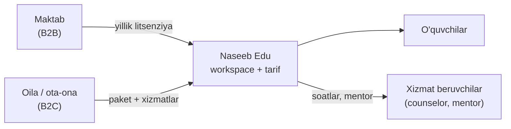
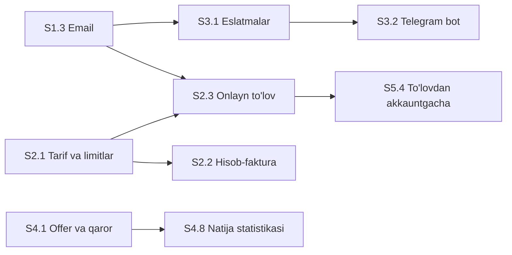

# Naseeb Edu — qisqa reja (jamoa uchun)

> **To'liq versiya:** [product-vision-and-stages.md](product-vision-and-stages.md) — inglizcha, batafsil. Bu uning qisqa, oddiy tildagi varianti (~10 daqiqada o'qiladi). Ikkalasi farq qilsa, to'liq versiya to'g'ri.
>
> **Sana:** 2026-09-24 · **Kod holati:** `origin/main` @ `465cf9a`
>
> **Belgilar:** ✅ bor · 🟡 qisman · ⬜ yo'q · 🔷 taklif (hali kelishilmagan)

---

## 1. Bir sahifada

**Nima qilyapmiz.** O'zbekistondagi maktab, maslahatchi (counselor), o'quvchi va ota-onalar uchun xalqaro universitetga topshirish jarayonini bitta tizimda yuritamiz. Dastur jarayonni tartibga soladi, qarorni maslahatchi qabul qiladi.

**Hozir nima bor.** O'quvchi yo'lining deyarli hammasi ishlaydi: profil, test, universitet tanlash, roadmap va vazifalar, hujjat va esse, arizalar, uchrashuv, xabarlar, ota-ona portali, admin panel. 6 rol, 3 til (uz/ru/en).

**Eng katta 5 bo'shliq:**

1. **Pul olish yo'q.** To'lov, tarif, obuna, hisob-faktura yo'q.
2. **Eslatma yetib bormaydi.** Email va Telegram ulanmagan.
3. **Universitet bazasi kichik.** Manbasi tasdiqlangani atigi 16 ta (AQSh 8 + Kanada 8), onboarding esa 7 mamlakat so'raydi.
4. **Production poydevori yo'q.** Staging, monitoring, ToS/Privacy yo'q; Sirdaryo'ga ko'chirish ochiq.
5. **Maktabga natija ko'rinmaydi.** Hisobot, offer va grant kuzatuvi yo'q. Maktabga sotishda aynan shu kerak.

---

## 2. Hozir nima bor, nima yo'q

- ✅ **Bor:** akkaunt berish + majburiy parol almashtirish · o'quvchi onboarding (6 bosqich) · Profile Assessment (4 test) · roadmap (Level 1) va vazifalar · arizalar · hujjat, esse, tavsiya xati · portfolio · uchrashuv so'rovi · xabarlar (guruh, community, moderatsiya) · support · ota-ona portali · Student 360 + audit · admin panel · landing (uz/ru/en) · PDF export.
- 🟡 **Qisman:** universitet moslash (baza kichik) · Store (namuna narx, sotib olish yo'q) · uchrashuv (bo'sh vaqt va eslatma yo'q) · AI yordamchi (kod tayyor, production'da yoqish ochiq) · bulk import (faqat alohida branch'da).
- ⬜ **Yo'q:** to'lov, tarif, hisob-faktura · email va Telegram · kalendar (ICS) · MFA · PWA · monitoring, staging, E2E · offer va viza bosqichi · Level 2+.

---

## 3. Mukammal holat

| Rol | Mukammal holatda | Hozir |
| --- | --- | --- |
| **O'quvchi** | Har kuni bitta aniq "keyingi qadam". Butun yo'l bir joyda: test → universitet → reja → hujjat va esse → topshirish → offer → viza | ✅ offer va viza yo'q |
| **Counselor** | "Bugungi navbat" bilan ishlaydi: tasdiq kutayotganlar, kechikkan o'quvchilar, bugungi uchrashuvlar | 🟡 navbat yo'q |
| **Teacher** | Vazifa va mission beradi, tasdiqlaydi | ✅ |
| **Maktab** | O'quvchilarni import qiladi; natijani ko'radi: nechta o'quvchi qayerga kirdi, qancha grant olindi | 🟡 import va hisobot yo'q |
| **Ota-ona** | Bolasining progressini ko'radi, haftalik xabar oladi, xizmat uchun to'laydi | 🟡 xabar va to'lov yo'q |
| **Admin (Naseeb)** | Maktab, akkaunt, tarif, kontent, support boshqaradi | 🟡 tarif va katalog boshqaruvi yo'q |
| **Mentor** (🔷 yangi) | Sotib olingan xizmatni bajaradi (esse tekshiruvi, interview mashqi...) | ⬜ |

**O'zgarmas qoidalar:**

- Progress "topiladi": vazifa, mission va level'ni staff tasdiqlaydi.
- AI faqat maslahat beradi, qaror qilmaydi va qabul ehtimolini aytmaydi.
- Ma'lumot o'quvchi va oilaniki. Maktab va admin ko'radigan doira aniq: private xabar, esse matni, meeting note ko'rinmaydi.
- Akkaunt "beriladi", ochiq ro'yxatdan o'tish yo'q. B2C uchun ham shu qoida qoladimi — D1 qarori.
- O'quvchilar voyaga yetmagan: ota-ona roziligi, uchinchi tomon trekerlarsiz.

---

## 4. Biznes model (🔷 taklif)

Bitta platforma, uch xil mijoz. **Tarif** — mijozga beriladigan huquq va limitlar to'plami (o'quvchi soni, counselor soni, AI so'rovlari, hisobotlar...). Mijoz chegarasi — `workspace` (maktab yoki individual ish maydoni).

| | B2B — maktab | B2C — oila | B2B2C — maktab ichidagi oila |
| --- | --- | --- | --- |
| **Kim to'laydi** | Maktab (shartnoma, bank o'tkazma) | Ota-ona | Ota-ona |
| **Nima sotiladi** | O'quv yili uchun litsenziya: platforma + counselor o'rinlari + o'quvchi o'rinlari | Paket (platforma + counselor soatlari) va alohida xizmatlar: esse tekshiruvi, interview mashqi, SAT... | Store xizmatlari |
| **Narxlash (tavsiya)** | Berilgan o'quvchi akkaunti soni × yillik narx, minimal ostona bilan | Counselor soati × soat soni + platforma ulushi | Xizmat narxi |
| **Akkaunt qanday ochiladi** | Admin maktab va org akkaunt ochadi, o'quvchilar import qilinadi | To'lovdan keyin akkaunt **beriladi**, o'zi ro'yxatdan o'tmaydi | Mavjud akkaunt |
| **Qanday sotamiz** | "Book a call" → demo → pilot → shartnoma | Naseeb Mind (bepul test) → lead → konsultatsiya → paket → to'lov | Maktab ichida, Store orqali |
| **Asosiy xarajat** | Onboarding, support, hosting, AI | Counselor soati (eng kattasi), mijoz jalb qilish, to'lov komissiyasi | Counselor / mentor soati |

- **Keyinroq:** homiy / fond kohortlari, mentorlar marketplace'idan komissiya.
- **Obuna tugasa:** workspace faqat o'qish rejimiga o'tadi, keyin eksport va arxiv. Ma'lumot hech qachon o'chirilmaydi.
- **Sotilmaydi:** o'quvchi ma'lumoti.
- **Naseeb Mind** — `personality.naseebedu.com` dagi alohida bepul test; B2C voronkasining boshi.
- **Narxlar ataylab yozilmagan.** To'liq versiyadagi 4.6-bo'lim varag'ini jamoa to'ldiradi: seat narxi, paket narxi, counselor soat narxi, AI va hosting xarajati, to'lov komissiyasi, mijoz jalb qilish narxi.

---

## 5. Stage'lar (7 ta)

**Stage** — bosqich. Har stage ichida **ish paketlari (WP)** bor: bitta odam bir haftadan kam vaqtda PR qila oladigan bo'lak. To'liq versiyada nomi `S1.3` (1-stage, 3-paket). Jami 60 ta.

| Stage | Maqsad | Asosiy ishlar | Tugadi deymiz |
| --- | --- | --- | --- |
| **S0 Kelishuv** (~1 hafta, kodsiz) | Qarorlar, qoidalar, board | Qarorlar sessiyasi (D1–D8, D15) · PR qoidalari · board · `todo.todo`ni board'ga ko'chirish · eskirgan hujjatlarni yangilash | Qarorlar yopildi, board tayyor |
| **S1 Poydevor** | Pilot maktablarni xavfsiz ulash | Staging va production · monitoring · email · o'quvchilar importi · maktab onboarding checklisti · ToS/Privacy · hisobot v1 · katalog boshqaruvi · MFA · E2E · AI'ni production'da yoqish | Pilot maktab staging'da butun oqimni bajardi |
| **S2 Pul olish** | Tijorat mexanizmi | Tarif va limitlar (to'lovsiz) · B2B hisob-faktura · onlayn to'lov · Store v1 · mentor roli · promo-kod · billing konsol · fiskal talablar | Bitta maktabga hisob-faktura to'landi, bitta oila onlayn to'ladi |
| **S3 Kundalik ishlash** | Haftalik faol foydalanish | Eslatmalar (email + Telegram) · kalendar · uchrashuv v2 · ota-ona v2 · PWA · counselor "Bugungi navbat" · roadmap v2 · o'quvchi dashboard v2 | Eslatmalar keladi, counselor navbatdan ishlaydi |
| **S4 Qabul va natija** | Qabuldan o'qishga kirishgacha + natija dalili | Offer va qaror · grant kuzatuvi · test tayyorgarligi · kollej ro'yxati v2 · esse v2 · tavsiyachi portali · qabuldan keyin (viza) · natija statistikasi · assessment v2 (yillik taqqoslash) · katalog kengaytirish va uz/ru tarjimasi | Offer va grant kuzatiladi, maktab hisobotida tasdiqlangan natija bor |
| **S5 Oila va o'sish** | Sotuv voronkasi, B2C | Lead saqlash · maktablar uchun sahifa · Mind → Edu ko'prigi · to'lovdan akkauntgacha · ommaviy katalog (SEO) · referal · analitika · counselor sig'imi | Lead saqlanadi, oila to'lovdan keyin akkaunt oladi |
| **S6 Ekotizim** (keyinroq) | Marketplace, hamkor va homiy, API, white-label, AI kengaytmalari | — | S2–S5 natijasi ko'ringandan keyin boshlanadi |

**Nima nimani ochadi** (soddalashtirilgan; to'liq graf — to'liq versiyaning 5.2-bandida):

**Bugun boshlash mumkin (boshqasini kutmaydi):** monitoring, email, o'quvchilar importi, hisobot v1, katalog boshqaruvi, MFA (S1) · kalendar, PWA, counselor navbati, dashboard v2 (S3) · offer va qaror, test tayyorgarligi, esse v2, assessment v2 (S4) · lead saqlash (S5). Ikkitasida yumshoq bog'liqlik bor: monitoring qaror D8 ga, lead saqlash D15 ga tayanadi.

---

## 6. Birinchi 2 hafta (🔷 tavsiya)

Taxmin: 2–3 dasturchi va 1 kontent/operatsiya mas'uli. Tanlangan ishlar turli fayllarga tegadi, shuning uchun konflikt kam.

| Hafta | Infra | Tijorat | Counselor / maktab | Kontent / o'sish |
| --- | --- | --- | --- | --- |
| 1 | S0 ishlari + email (S1.3) | — | Bulk import'ni main'ga rebase (S1.4) | Katalog: admin filtr va tekshiruv navbati (S1.8) |
| 2 | Monitoring (S1.2) | Tarif va limitlar: modellar + admin, to'lovsiz (S2.1) | Hisobot v1: endpoint (S1.7) | Lead modeli va endpoint (S5.1) |

Nega aynan shular: hammasi boshqasini kutmaydi, keyingi zanjirlarni ochadi va hafta oxirida ko'rsatiladigan natija beradi. Monitoring D8 ga, tarif va lead D15 ga tayanadi — shu qarorlar 1-haftada yopiladi.

---

## 7. Qanday ishlaymiz

- **Bitta odam — bitta WP.** Bir vaqtda ishlayotganlar turli yo'nalishdan tanlaydi (infra, tijorat, o'quvchi, counselor/maktab, kontent, o'sish, AI), shunda fayllar to'qnashmaydi.
- **PR:** ~400 qatordan oshmasin · test bor (noto'g'ri rol holati ham) · uz/ru/en matn · `./scripts/verify.sh` yashil · PR'da demo (screenshot yoki GIF).
- **Katta fayllarga** (`App.jsx`, `views.py`, `serializers.py`, `styles.css`, `tests.py`) minimal tegamiz. Yangi UI — alohida `frontend/src/<Feature>.jsx`; yangi backend — alohida modul yoki yangi app (D15).
- **Migratsiya:** bir vaqtda bitta ochiq PR bitta app'ga migratsiya qo'shadi; merge oldidan rebase.
- **Tugallanmagan narsa** feature flag orqasida main'ga kiradi. Branch bir haftadan uzoq yashamaydi, har kuni main'dan rebase.
- **Haftalik ritm:** dushanba (30 daqiqa) — kim qaysi WP'ni oladi · har kuni kichik PR, review 24 soat ichida · payshanba yoki juma (30 daqiqa) — demo · juma — haftalik xabar: `✅ merge · 🎬 demo · ⏭ keyingi hafta · ⚠️ to'siq`.

---

## 8. Avval hal qilinadigan qarorlar (S0)

| # | Savol | Tavsiya (🔷) |
| --- | --- | --- |
| D1 | B2C qanday bo'ladi? A) faqat concierge, B) Mind → to'lov → akkaunt beriladi, C) to'liq o'zi ro'yxatdan o'tadi | **B.** "Ochiq ro'yxatdan o'tish yo'q" va'dasi va maxfiylik saqlanadi; voyaga yetmaganlar, moderatsiya va support xavfi C'dan kam |
| D2 | B2C'da kim to'laydi va rozilik beradi? | Ota-ona; 18+ o'quvchi o'zi |
| D3 | To'lov usuli va valyuta | B2C — UZS onlayn (mahalliy provayder); B2B — hisob-faktura + bank o'tkazma |
| D4 | B2B narx birligi | Berilgan o'quvchi akkaunti soni / yil + minimal ostona |
| D5 | Pilot qoidalari | Bir o'quv davri, cheklangan o'quvchi soni, yozma yakun mezoni (muddatni jamoa belgilaydi) |
| D6 | Counselor kim bo'ladi? | Avval Naseeb xodimlari + cheklangan mentorlar; ochiq marketplace keyin |
| D7 | Maktab ketsa nima bo'ladi? | Read-only rejim + eksport (muddatni jamoa belgilaydi) |
| D8 | Hosting va ma'lumot joylashuvi | Avval yurist tasdig'i, keyin Sirdaryo serverlariga ko'chirish |
| D15 | Yangi domenlar (billing, eslatma, lead) alohida Django app'dami? | Ha: konflikt va migratsiya to'qnashuvi kamayadi |

Qolgan 11 ta qaror (D9–D14, D16–D20) to'liq versiyaning 6-bo'limida. Ular tegishli ish boshlanishidan oldin yopiladi.

---

## 9. Hozircha qilmaymiz va tasdiqlanishi kerak

**Hozircha qilmaymiz:** o'z LMS yoki video dars · qabul kafolati yoki ehtimolini ko'rsatish · o'quvchi ma'lumotini sotish · ochiq self-serve o'quvchi ro'yxatdan o'tishi (D1 gacha) · AI'ning yozuvchi amallari · native mobil ilova (PWA natijasigacha) · O'zbekistondan tashqari bozor.

**Kodda ko'rinmaydi, jamoa tasdiqlashi kerak:** hozirgi production hosting (Render'mi, boshqami) · AI kalitlari production'da yoqilganmi · production bazadagi haqiqiy katalog hajmi · huquqiy, to'lov va fiskal masalalar (yurist va buxgalter).

---

## 10. Keyingi qadam

1. Hamma shu qisqa versiyani o'qiydi.
2. Qarorlar sessiyasi: D1–D8 va D15.
3. Board ochiladi, birinchi 3 ish paketi `Ready`ga qo'yiladi, haftalik ritm boshlanadi.
